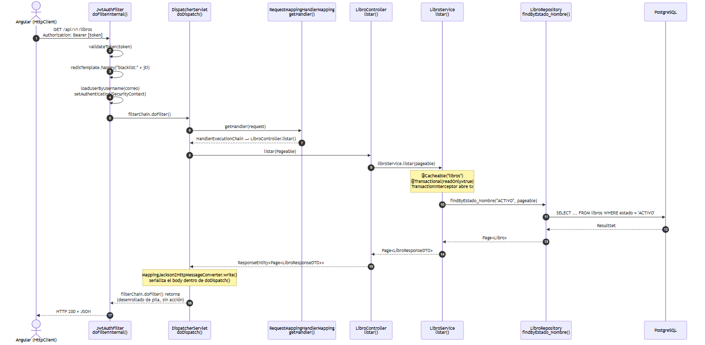

# Sistema de Gestión Bibliotecaria Web (SGB - SaaS) 📚

[](https://github.com/mloorm14/sgb-saas/actions/workflows/ci.yml)
[](https://doi.org/10.5281/zenodo.21712467)

Plataforma 100% web diseñada para la modernización de bibliotecas institucionales y municipales, desarrollada como Proyecto Fin de Curso para la asignatura de Aplicaciones Web (2026-2027).

## 🎬 Demo

Video demo del sistema (2-3 min): [ver en Google Drive](https://drive.google.com/file/d/19s7Ls2Ixz7wJ7RWzfJ-F2U18LknC7O_r/view?usp=drive_link)

> ⚠️ **Pendiente de confirmación manual**: no es posible verificar desde aquí que el permiso de este enlace de Drive esté en modo "Cualquier usuario con el enlace puede ver". Antes de la entrega final, confirmar manualmente en Drive (botón "Compartir" → "Acceso general") que el enlace es público; si está restringido a cuentas específicas, un evaluador externo no podrá reproducirlo.

## 🚀 Despliegue y Acceso Demo

> **Requisito A.4.1** — acceso público y cuenta demo para el tribunal evaluador.

El despliegue público usa **Render** (aplicación), **Neon** (PostgreSQL) y **Upstash** (Redis). El sistema está desplegado y accesible en producción.

**URL pública:**

```text
https://biblora-sgb.onrender.com
```

### Credenciales demo (tribunal evaluador)

Cuenta preconfigurada en la semilla real `db/seed.sql` (usuario administrador de desarrollo / demo). Mismos valores que usa el entorno local y el script k6 (`admin@sgb-saas.local` / `Admin123!`).

| Campo | Valor |
|-------|-------|
| **Rol** | Administrador / Tribunal (`ADMIN`) |
| **Usuario / Email** | `admin@sgb-saas.local` |
| **Contraseña** | `Admin123!` |

```text
Rol:      Administrador / Tribunal
Email:    admin@sgb-saas.local
Password: Admin123!
```

> ⚠️ Credenciales **solo** para evaluación académica / entorno demo. No usarlas con datos personales reales.

**Health check del backend:** https://sgb-backend-b058.onrender.com/actuator/health
(el backend corre en el plan Free de Render: duerme tras 15 min de
inactividad, así que la primera petición tras un rato sin tráfico puede
tardar ~30–60 s en responder — cold start). Detalle completo de la
arquitectura desplegada en [docs/despliegue/DEPLOYMENT.md](docs/despliegue/DEPLOYMENT.md).

## 👥 Equipo de Desarrollo

- Cajas Ibarra Irvin Marcelo — Backend (CRUD)
- Loor Medranda Marlon Taylor — Tech Lead / DevOps / Seguridad
- Panama Murillo Moises Antonio — Frontend

## 🚀 Tecnologías

- **Frontend:** Angular 17 / Tailwind CSS
- **Backend:** Spring Boot 4.0.6 / Java 21 / Spring Security 7.x
- **Base de datos:** PostgreSQL 16
- **Caché y Auth:** Redis 7 (lista negra de tokens JWT)
- **Migraciones:** Flyway 9
- **Documentación API:** springdoc-openapi (Swagger UI)
- **IA Integrada:** Gemini 2.0 Flash API (Entrega 2)

---
## 🔄 Flujo MVC — Ciclo de vida de una petición autenticada



[Ver diagrama en detalle](docs/diagramas/flujo-mvc-springboot.md)

| # | Componente | Descripción |
|---|---|---|
| 1 | Angular `HttpClient` | Envía `GET /api/v1/libros` con `Authorization: Bearer [token]` |
| 2 | Tomcat embebido | Recibe la conexión TCP, parsea el HTTP y crea `HttpServletRequest` |
| 3 | `DispatcherServlet.doDispatch()` | Punto de entrada de Spring MVC; enruta la solicitud al `HandlerMapping` |
| 4 | `JwtAuthFilter.doFilterInternal()` | Valida firma/expiración del token, consulta blacklist en Redis y establece el `SecurityContext` |
| 5 | `RequestMappingHandlerMapping.getHandler()` | Localiza el método del controlador que coincide con la URL y el verbo HTTP |
| 6 | `LibroController.listar()` | Recibe `Pageable` ya mapeado, delega al servicio |
| 7 | `LibroService.listar()` | Lógica de negocio; `@Cacheable("libros")` + `@Transactional(readOnly=true)`; llama al repositorio |
| 8 | `LibroRepository.findByEstado_Nombre()` | Spring Data JPA genera el SQL; Hibernate lo ejecuta contra PostgreSQL |
| 9 | `MappingJackson2HttpMessageConverter.write()` | Serializa `Page<LibroResponseDTO>` a JSON dentro de `doDispatch()` antes de retornar |
---

## 🔐 Autenticación

Autenticación stateless basada en **JWT (HS256)**: `accessToken` de corta duración (1h) + `refreshToken` (7 días, cookie `HttpOnly`). Los tokens revocados se almacenan en Redis (blacklist por `jti`) para permitir invalidación de sesión antes de su expiración natural.

## ⚙️ Instrucciones de instalación local

### Requisitos previos

- Docker y Docker Compose
- Node.js v18+ (solo si se desea ejecutar el frontend fuera de Docker)
- Java 21+ (solo si se desea ejecutar el backend fuera de Docker)

### Pasos (con Docker Compose — recomendado)

1. Clonar este repositorio:
   
   ```bash
   git clone https://github.com/mloorm14/sgb-saas.git
   cd sgb-saas
   ```
1. Copiar las variables de entorno:
   
   ```bash
   cp .env.example .env
   ```
   
   Editar `.env` y definir `JWT_SECRET` (mínimo 256 bits, generado con `openssl rand -hex 32`).
1. Levantar todos los servicios:
   
   ```bash
   docker compose up --build -d
   ```
1. Verificar que todos los servicios estén en estado `healthy`:
   
   ```bash
   docker compose ps
   ```
1. Ejecutar las pruebas unitarias (sin Docker, requiere Java 21):
   
   ```bash
   cd backend-springboot
   ./mvnw test
   ```
   
   NOTA: en Windows usar `mvnw.cmd` en lugar de `./mvnw`

### Acceso a la aplicación

|Servicio          |URL                                        |
|------------------|-------------------------------------------|
|Frontend (Angular)|<http://localhost:4200>                    |
|API Backend       |<http://localhost:8080>                    |
|Swagger UI        |<http://localhost:8080/swagger-ui.html>    |
|Actuator health   |<http://localhost:8080/actuator/health>    |
|PostgreSQL        |localhost:5432                             |
|Redis             |localhost:6379                             |

## 📂 Estructura del repositorio

```
sgb-saas/
├── backend-springboot/   # API REST: Spring Boot 4.0.6 + JPA + Security + JWT
├── frontend-angular/      # SPA Angular 17
├── database/
│   └── migrations/        # Scripts versionados de Flyway (V1__, V2__, ...)
├── docs/                   # Diagramas, ADRs, informes técnicos
├── docker-compose.yml      # Orquestación de servicios
└── .env.example            # Plantilla de variables de entorno
```

## 🌳 Flujo de trabajo Git

- `main`: código estable de entregas cerradas (solo via Pull Request).
- `develop`: rama de integración continua.
- `feature/*`: ramas de trabajo individuales, integradas mediante Pull Request hacia `develop`.

Convención de commits: [Conventional Commits](https://www.conventionalcommits.org/) (`feat:`, `fix:`, `refactor:`, `test:`, `docs:`).

## 🔑 Credenciales de desarrollo (local)

Al inicializar la base de datos con `db/schema.sql` + `db/seed.sql` (montados
en `docker-entrypoint-initdb.d/`), se crea el mismo usuario administrador
documentado arriba en la sección **Despliegue y Acceso Demo**:

| Campo      | Valor                     |
|------------|---------------------------|
| Correo     | `admin@sgb-saas.local`    |
| Contraseña | `Admin123!`               |
| Rol        | `ADMIN`                   |

Fuente verificada: `db/seed.sql` (comentario «Contraseña en texto plano: Admin123!» + `INSERT` de `admin@sgb-saas.local`). No existe un `V2__insert_data.sql` en este repositorio; Flyway `V2__rbac_normalizado.sql` no inserta ese usuario.

⚠️ Solo para entornos locales de desarrollo / demo académica. Nunca usar estas credenciales
en un entorno con datos personales reales.

### 👤 Cuenta demo (para evaluación — credenciales públicas)

El sistema desplegado en producción (https://biblora-sgb.onrender.com)
incluye un usuario demo de acceso libre para el tribunal, creado por la
migración Flyway `V11__seed_usuario_demo.sql` (y normalizado por
`V12__fix_usuario_demo.sql` para cuentas preexistentes), **separado del
admin real y con rol limitado (LECTOR, sin permisos administrativos)**:

| Campo      | Valor                  |
|------------|------------------------|
| Correo     | `u@uteq.edu.ec`        |
| Contraseña | `usuario1`             |
| Rol        | `LECTOR`               |

Este usuario es el que el tribunal puede usar para entrar sin
registrarse. No modifica ni comparte la cuenta `admin@sgb-saas.local`.

⚠️ **Nota de corrección (2026-08-23, verificación pre-defensa):** una
auditoría en vivo contra producción, horas antes de la defensa, encontró que
la cuenta `u@uteq.edu.ec` tenía asignados **dos roles a la vez** (`LECTOR` y
`GERENTE`). Causa: `V12__fix_usuario_demo.sql` solo *agrega* el rol `LECTOR`
(`ON CONFLICT DO NOTHING`) pero nunca elimina otros roles que ya existieran
en esa fila, así que un `GERENTE` preexistente en esa cuenta no se limpiaba
solo. El login devolvía `GERENTE`, contradiciendo lo documentado arriba.

Se corrigió con un script SQL aplicado directamente contra la base de
producción (Neon, branch `production`) que deja esa cuenta con
**únicamente** el rol `LECTOR`, tal como pretendían V11/V12. **Esta
corrección no está reflejada como una migración Flyway versionada en
`database/migrations/`** — es un parche puntual sobre producción para no
bloquear la defensa; una base reprovisionada desde cero (`make up` /
clonación limpia) no reproduce este estado hasta que se agregue una
migración `V__` equivalente al repositorio.

Además, no existían credenciales demo públicas para el rol `BIBLIOTECARIO`
ni para un `LECTOR` alternativo separado de `u@uteq.edu.ec`. Se crearon dos
cuentas nuevas para cubrir esos roles, independientes de cualquier cuenta
real de un integrante del equipo:

| Campo | Valor |
|-------|-------|
| **Rol** | `LECTOR` |
| **Usuario / Email** | `lector.demo@sgb-saas.local` |
| **Contraseña** | `Lector123!` |

| Campo | Valor |
|-------|-------|
| **Rol** | `BIBLIOTECARIO` |
| **Usuario / Email** | `bibliotecario.demo@sgb-saas.local` |
| **Contraseña** | `Bibliotecario123!` |

| Campo | Valor |
|-------|-------|
| **Rol** | `GERENTE` |
| **Usuario / Email** | `gerente.demo@sgb-saas.local` |
| **Contraseña** | `Gerente123!` |

> ⚠️ Mismo criterio que el resto de esta sección: credenciales **solo**
> para evaluación académica / entorno demo.

Para los 4 roles del sistema, el tribunal puede entrar con:

- **ADMIN** — `admin@sgb-saas.local`
- **GERENTE** — `gerente.demo@sgb-saas.local`
- **BIBLIOTECARIO** — `bibliotecario.demo@sgb-saas.local`
- **LECTOR** — `lector.demo@sgb-saas.local` o `u@uteq.edu.ec` (LECTOR).

## 📦 Imágenes Docker publicadas (v1.0.0)

Las imágenes se publican en GitHub Container Registry (GHCR) por el
workflow `publish-ghcr.yml`, que se dispara con el push del tag `v1.0.0`
(no por push a rama ni por PR). Digests verificados con `docker pull` +
`docker inspect` real contra el commit `8610ab0` (el mismo que main y
demo/interfaces-completas, y el que está sirviendo en producción).

| Servicio  | Imagen                                   | Digest sha256 |
|-----------|------------------------------------------|---------------|
| Backend   | `ghcr.io/mloorm14/sgb-saas-backend:v1.0.0`  | `sha256:2cb9f065d4c81cce11ab8b6d113fe20eb8603828ac2a087535280cb54d3f8598` |
| Frontend  | `ghcr.io/mloorm14/sgb-saas-frontend:v1.0.0` | `sha256:ea3d681b322c06ea3d2657e46d712fadf080e0074575336f0aa27399bd6cd91f` |

## 🔁 Reproducibilidad (D.1 / D.2)

El repositorio se orquesta con `make` y el pipeline completo se corre de
punta a punta desde un clone limpio con un solo comando (criterio D.1 de la
guía):

```bash
make all   # = up → test → bench → audit → docs → compilar PDF del informe
```

Targets disponibles: `up` `down` `test` `bench` `audit` `docs` `all` `clean`.

- **`make docs`** regenera la evidencia documental que cambia con cada
  corrida: `docs/entorno/versions.txt` (versiones **reales** del entorno —
  Docker, docker compose, JDK, Node, Angular CLI, Python y k6, criterio D.2 —
  vía `scripts/capture-versions.sh`), el análisis estadístico de rendimiento
  (Wilcoxon pareado + Cliff's delta, `scripts/perf-analysis.py`) y verifica
  (solo advierte, no regenera) la sincronía del render C4 contra
  `docs/arquitectura/workspace.dsl`.
- **Notebooks con outputs archivados**: `docs/mediciones/perf-analysis.ipynb`
  (análisis de rendimiento, invoca `scripts/perf-analysis.py` — una sola
  fuente de verdad, no duplica lógica) y `docs/mediciones/sus-analysis.ipynb`
  (SUS, en estado *pendiente de datos* — no se fabrican resultados).
- **Semillas fijas (D.2)**: toda aleatoriedad del pipeline usa semilla
  explícita, no el default no determinista del lenguaje — el PRNG
  `mulberry32` de `k6/libros-listado-test.js` y el bootstrap del IC 95% del
  p95 en `scripts/perf-analysis.py` (`BOOTSTRAP_SEED`) usan **42**, ambos
  documentados en su propio código. El resto del pipeline (agregación
  estadística, SUS pendiente) no usa muestreo aleatorio: *no aplica*,
  confirmado. Ver también la convención en `docs/mediciones/README.md`.
- **Requisitos adicionales** para `make all`: `latexmk` (compilar el PDF —
  Windows: MiKTeX, `winget install MiKTeX.MiKTeX`; Debian/Ubuntu:
  `apt install latexmk`) y Chrome instalado (para `make test-frontend` con
  ChromeHeadless). `make test-frontend` instala `node_modules` automáticamente
  si faltan (`npm ci`, mismo paso que CI).

## 📄 Estado del proyecto

**Entrega 1B (Junio 2026):** módulo de autenticación JWT + CRUD de `Libro` con Spring Data JPA, Flyway, Redis y Docker Compose. Ver `docs/` para el informe técnico completo.