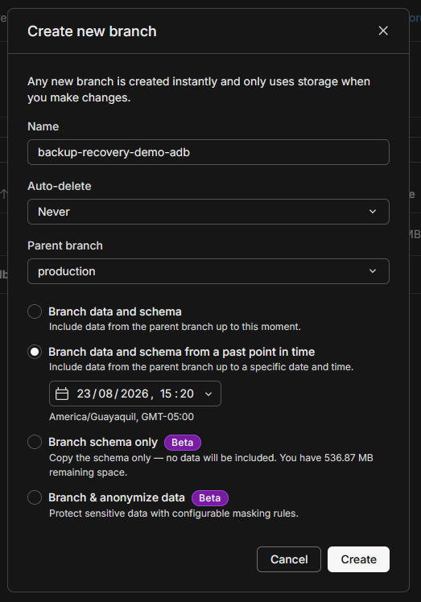
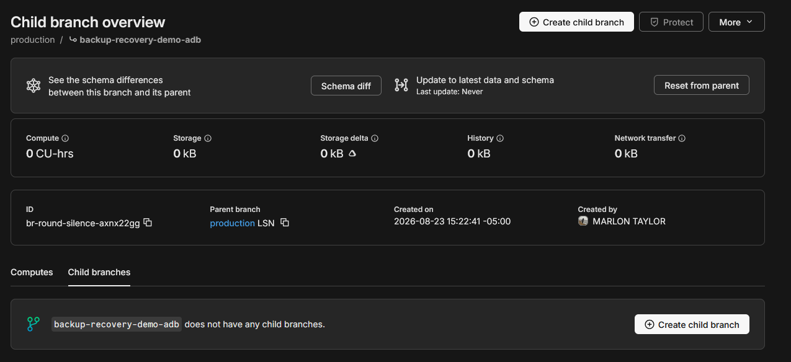
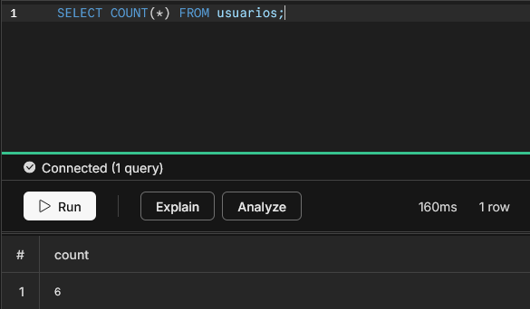
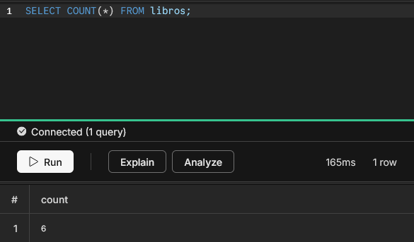
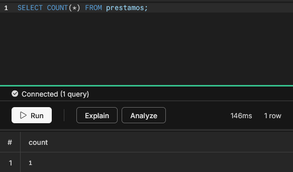

# BACKUP — Respaldo y restauración de datos SGB-SaaS

Estrategia de respaldo de la base de datos de producción (Neon Postgres,
plan Free) y requisitos de retención para la Entrega Final.

## 1. Estrategia de respaldo

La base de datos es **Postgres gestionado por Neon**. Neon mantiene la
retención automática por dos mecanismos nativos de infraestructura:

1. **Point-in-time restore (PITR) / instant restore:** Neon conserva un
   *historial de cambios* de la rama raíz y permite reconstruir el estado
   de la base en cualquier instante dentro de esa ventana. Es el método
   principal de restauración (ver [RUNBOOK.md](RUNBOOK.md) §4).
2. **Branching:** se puede crear una rama (child branch) desde la rama
   raíz en el punto en el tiempo deseado y leerla/verificarla sin tocar el
   estado actual de producción.

Además de estos dos mecanismos de infraestructura, el repositorio SÍ
incluye ahora un mecanismo de respaldo a nivel de aplicación —
`backup-service/`, un volcado completo con `pg_dump` subido a
almacenamiento externo — documentado por separado en §6, distinto de
ambos mecanismos de Neon de arriba.

### 1.1 Límites del plan Free de Neon (vigencia verificada: agosto 2026)

Confirmado contra la documentación oficial de Neon
(`neon.com/docs/introduction/plans`):

- **Ventana de historial (PITR): 6 horas**, con tope de **1 GB de
  cambios** acumulados, **sin cargo**. La ventana NO es configurable en el
  plan Free (en Launch/Scale es de hasta 7/30 días, facturada aparte).
- **Snapshots manuales: 1 permitido** en el plan Free (los backups
  programados no existen en Free). El almacenamiento de snapshots se
  factura aparte ($0.09/GB-mes) — para este proyecto académico el snapshot
  manual se usa como evidencia puntual, no como rutina.
- Cómputo: 100 CU-horas/mes (Neon lo duplicó de 50 a 100 en octubre
  2025); escala a cero a los 5 min de inactividad.
- Almacenamiento: 0.5 GB.

**Implicación práctica:** con la ventana PITR de solo 6 horas, el respaldo
de largo plazo NO se basa en PITR: se basa en (a) mantener los servicios
vivos durante todo el periodo de retención exigido (el dato sigue en la
base, nada se borra) y (b) el snapshot manual como garantía puntual
opcional antes de la defensa. Si se quisiera retención de días/meses
automatizada, sería necesario migrar a un plan de pago de Neon — fuera de
alcance de este proyecto.

## 2. Retención mínima obligatoria

- **Fecha de defensa:** 17 de agosto de 2026.
- **Retención exigida:** 30 días posteriores a la defensa →
  **mínimo hasta el 16 de septiembre de 2026** (2026-08-17 + 30 días).

Hasta esa fecha:

- **Render:** NO suspender, cancelar ni eliminar ninguno de los dos
  servicios (Web Service del backend y Static Site del frontend). El plan
  Free suspende solo por inactividad (backend) — eso es normal y no
  afecta la retención; lo que no puede pasar es borrar los servicios ni
  sus variables de entorno.
- **Neon:** NO eliminar el proyecto ni la base (no hay exportación
  equivalente al dato original en otro lado; la rama raíz ES el dato). Si
  el equipo quiere una red de seguridad extra, crear el **snapshot manual
  único** del plan Free en esa ventana.
- **Upstash:** NO eliminar la base de datos. Su contenido (blacklist de
  tokens y contadores de rate limit) es recreable, pero su eliminación
  rompería la operación del backend durante el periodo de evaluación.
- Verificación de vencimiento del periodo: pasado el 2026-09-16 se puede
  decidir libremente el desmantelamiento (siguiendo primero la prueba de
  restauración de §3 si hubiera quedado pendiente).

## 3. Procedimiento de prueba de restauración (evidencia real)

Objetivo: demostrar que el mecanismo de respaldo funciona **de verdad**
(no asumirlo), generando evidencia reproducible delante del tribunal.

### 3.1 Prerrequisitos

- Acceso al proyecto Neon de producción (dashboard) y a la URL de
  conexión de la rama raíz.
- Datos verificables: anotar antes de la prueba un par de valores de
  control (p. ej. el total de filas de `libro` o un registro creado hace
  unos minutos) y la marca de tiempo de un cambio reciente conocido.

### 3.2 Pasos

1. **Crear un cambio conocido:** insertar un registro marcador (o usar
   uno reciente) y anotar su `created_at` / timestamp del sistema.
2. **Crear el branch desde un punto anterior en el tiempo:**
   Neon dashboard → **Branches** → **Create branch** → elegir la rama
   raíz y seleccionar una **fecha/hora anterior** al cambio conocido
   (dentro de la ventana de 6 h; p. ej. 2–3 h atrás). Neon crea una
   child branch con el estado exacto de ese instante.
3. **Verificar la integridad:**
   - Conectar a la URL de conexión de la branch creada (se usa un
     cómputo nuevo que Neon levanta solo para esa rama; es de solo
     lectura salvo que se le agregue un cómputo de escritura).
   - Comprobar que el registro marcador del paso 2 **no existe** (porque
     el punto elegido es anterior) y que el resto de tablas/series están
     presentes e íntegras (p. ej. `SELECT count(*) FROM libro` coincide
     con lo esperado para esa fecha).
   - Comparar contra la rama raíz actual: ahí el registro marcador SÍ
     existe → prueba de que el PITR reconstruyó un estado distinto y
     consistente.
4. **Evidencia:** guardar capturas de pantalla del dashboard (branch
   creada, timestamp elegido) y de las dos consultas (con/sin marcador).
   Archivar en `docs/mediciones/` si el equipo lo requiere para la
   entrega.
5. **Limpiar:** borrar la branch de prueba una vez verificada (las
   branches hijas no cuentan contra el cupo de PITR, pero conviene no
   dejar ramas huérfanas).

### 3.3 Qué significa "restauración exitosa"

La prueba es exitosa si: la branch se crea desde el punto pedido, los
datos consultables son el estado **de ese instante** (sin el cambio
posterior), las consultas de integridad (conteos, FKs) no reportan
errores y se puede leerla sin afectar a producción. No se requiere
restaurar encima de la rama raíz en la prueba (eso es el paso de
recuperación real del RUNBOOK §4, que solo se ejecuta ante un incidente).

## 4. Referencias

- [RUNBOOK.md](RUNBOOK.md) §4 — recuperación ante incidente usando este mecanismo.
- [DEPLOYMENT.md](DEPLOYMENT.md) — arquitectura y límites del plan.
- Documentación oficial Neon (verificada agosto 2026): `neon.com/docs/introduction/plans` (ventana de historial, snapshots), `neon.com/docs/guides/branch-restore`.

## 5. Evidencia de ejecución real — branches de Neon

### 5.1 Ejecución original (2026-08-23) — branch posteriormente perdida

Esta sección documenta una prueba **real ejecutada** de Point-in-Time Recovery (PITR) el 2026-08-23, distinta del procedimiento genérico de §3 que permanece tal cual.

> **Estado actual (2026-08-31): este branch original ya no existe** — se
> perdió en algún momento entre el 2026-08-23 y el 2026-08-31 (causa no
> determinada). Este subapartado se conserva tal cual para no borrar el
> registro histórico de lo que realmente se ejecutó y verificó ese día.
> El reemplazo, con un branch nuevo del mismo nombre pero de tipo
> distinto, está documentado en §5.2.

**Branch creada:** `backup-recovery-demo-adb`, ID `br-round-silence-axnx22gg`, parent `production`, restaurada al punto en el tiempo **2026-08-23 15:20 America/Guayaquil (GMT-05:00)**, creada **2026-08-23 15:22:41 -05:00** por **Marlon Taylor**.

**Diferencia metodológica con §3.2:** el procedimiento de §3.2 describe un enfoque de "registro marcador" (insertar un dato, restaurar a un punto anterior y verificar su ausencia). En esta ejecución real se usó una variante válida y honesta: se compararon conteos de filas entre la rama `production` y la rama restaurada **en el mismo punto en el tiempo**, confirmando integridad y consistencia del dato restaurado (no ausencia de un cambio posterior). Esto valida que el PITR reconstruye correctamente el estado histórico completo.

**Resultados de verificación (idénticos entre producción y branch restaurada):**
- `usuarios`: 6 filas
- `libros`: 6 filas
- `prestamos`: 1 fila

**Evidencia visual:**

**Nota sobre limpieza (histórica, ya no vigente):** a diferencia del paso 5 de §3.2 que sugiere borrar la branch de prueba, la intención original era mantener esta branch **deliberadamente viva** como evidencia tangible para el tribunal, sin eliminarla. En la práctica, el branch se perdió de todos modos antes del 2026-08-31 (ver nota de estado actual arriba) — se documenta también esta discrepancia entre la intención y el resultado, en vez de silenciarla.

### 5.2 Reemplazo (2026-08-31)

**Branch creada:** `backup-recovery-demo-adb`, ID
`br-late-band-ax2dz54h`, parent `production`, tipo
**"Branch data and schema"** — una copia del estado **actual** de
`production` en el momento de la creación, **no** una restauración a un
punto en el tiempo anterior. Creada **2026-08-31** por **Marlon Loor**.

**Por qué no es PITR esta vez:** a diferencia de §5.1, esta ejecución no
usó point-in-time restore porque el historial/retención de PITR de este
proyecto Neon está **deshabilitado en su estado actual** (ver §1.1 sobre
los límites del plan Free — la ventana de 6 h no estaba disponible/activa
para este proyecto al momento de crear el branch de reemplazo). Se deja
esto dicho explícitamente en vez de presentar una copia del estado actual
como si fuera una restauración a un punto en el tiempo verificado, que no
lo es.

**Verificación:** no se repitió el procedimiento de conteo de filas
descrito en §5.1 para este branch de reemplazo; no hay evidencia visual
nueva capturada todavía. Si el equipo quiere el mismo nivel de evidencia
que §5.1, seguir los pasos de §3.2 contra este branch nuevo antes de la
defensa.

## 6. Mecanismo adicional: microservicio `backup-service` (volcado completo vía pg_dump)

Distinto de los dos mecanismos de Neon descritos en §1 (PITR y branching,
ambos a **nivel de infraestructura**, gestionados por Neon) y distinto
también del endpoint Java `BackupController`
(`/api/v1/admin/backups`, backend Spring Boot) que ya existe en el
proyecto para exportar **selectivamente** tablas y rangos de fecha
específicos a SQL/CSV — ese es un export parcial bajo demanda, no un
volcado completo de la base.

`backup-service/` es un microservicio Node.js independiente (Dockerfile
propio, desplegado como servicio privado separado en Render, ver
`render.yaml`) cuyo propósito es un **volcado completo** de la base:

### 6.1 Qué hace

1. Ejecuta `pg_dump --format=c` (formato *custom* de PostgreSQL,
   comprimido, restaurable con `pg_restore`) contra la base completa —
   ver `backup-service/src/dump.js`.
2. Sube el archivo `.dump` resultante a almacenamiento externo S3-
   compatible vía `@aws-sdk/client-s3` — ver `backup-service/src/s3.js`.
   Si `BACKUP_STORAGE_URL` empieza con `s3://`, se sube a Cloudflare R2
   usando `R2_ENDPOINT`/`R2_ACCESS_KEY_ID`/`R2_SECRET_ACCESS_KEY`/
   `R2_BUCKET_NAME`; si no, cae a almacenamiento en el sistema de
   archivos local del contenedor (`./backups` o la ruta de
   `BACKUP_STORAGE_URL`) — solo relevante para desarrollo local, no para
   producción.
3. Si `BACKUP_ENCRYPTION_KEY` está configurada, cifra el dump con
   AES-256-GCM antes de subirlo (IV + ciphertext + tag concatenados);
   si no está configurada, sube el `.dump` sin cifrar.
4. Registra cada ejecución (inicio, éxito/fallo, nombre de archivo,
   tamaño en bytes, ruta en el storage, mensaje de error si falla) en la
   tabla `registros_respaldo`, escrita directamente por SQL desde el
   propio microservicio (no vía llamada HTTP al backend Spring Boot,
   pese a que un comentario en
   `RespaldoCompletoController.java` sugiere lo contrario — verificado
   leyendo `backup-service/src/dump.js`, que hace `pool.query` directo).

### 6.2 Cómo se dispara

- **Manual:** un ADMIN autenticado en el frontend llama a
  `POST /api/v1/admin/respaldo-completo/trigger` en el backend Spring
  Boot (`RespaldoCompletoController`, protegido con
  `@PreAuthorize("hasRole('ADMIN')")`), que actúa como proxy: reenvía la
  petición a `POST /api/v1/trigger` en el microservicio Node.js,
  agregando el header `x-internal-api-key` (variable de entorno
  `INTERNAL_API_KEY`, compartida entre ambos servicios). El microservicio
  valida ese header antes de ejecutar nada — sin la key correcta,
  responde 401.
- **Automático:** el propio microservicio corre un cron interno
  (`node-cron`, `0 * * * *` — cada hora en punto) que lee la fila más
  reciente de `configuracion_respaldo`; si `habilitado` es verdadero y ya
  se alcanzó `proxima_ejecucion`, dispara el backup y recalcula la
  próxima ejecución sumando `frecuencia_horas`.

### 6.3 Restauración: NO existe todavía (brecha conocida)

**No hay ningún endpoint ni script de restauración** para los dumps que
genera este microservicio. Se verificó explícitamente buscando
`restore`/`restaurar`/`pg_restore` en todo `backup-service/src/` y en
todo `backend-springboot/src/main/java/com/uteq/backend/`: cero
resultados en ambos casos. Recuperar un backup generado por este
mecanismo requeriría hoy:

1. Descargar manualmente el `.dump` desde el bucket de R2 (no hay UI ni
   endpoint para esto tampoco — descarga manual vía dashboard/CLI de
   Cloudflare o AWS CLI apuntando al endpoint S3-compatible).
2. Si el dump fue subido cifrado (`BACKUP_ENCRYPTION_KEY` configurada),
   descifrarlo manualmente (AES-256-GCM, IV+ciphertext+tag) — no hay
   script en el repo para este paso tampoco.
3. Ejecutar `pg_restore` manualmente contra una base de destino.

Ninguno de estos tres pasos ha sido probado ni documentado con evidencia
real todavía. Esto se deja como brecha honesta, no como capacidad
completada — no se afirma que este mecanismo provee recuperación ante
desastres end-to-end mientras el camino de restauración siga sin
implementar ni verificar.

### 6.4 Dónde quedan los dumps

Cloudflare R2, bucket configurado vía la variable de entorno
`R2_BUCKET_NAME` (junto con `R2_ENDPOINT`, `R2_ACCESS_KEY_ID`,
`R2_SECRET_ACCESS_KEY` y `BACKUP_STORAGE_URL=s3://...`). En
`render.yaml` estas variables están declaradas con `sync: false` — sus
valores reales (nombre de bucket, endpoint, región, política de
retención del bucket en sí) se configuran manualmente en el dashboard de
Render/Cloudflare y no están en el repositorio:

- Nombre de bucket real: `<PENDIENTE_CONFIRMAR>`
- Región/endpoint R2 real: `<PENDIENTE_CONFIRMAR>`
- Política de retención/expiración de objetos en el bucket: `<PENDIENTE_CONFIRMAR>` (no hay lifecycle policy visible en el código; si existe, está configurada directamente en el bucket de Cloudflare, fuera del repo)
