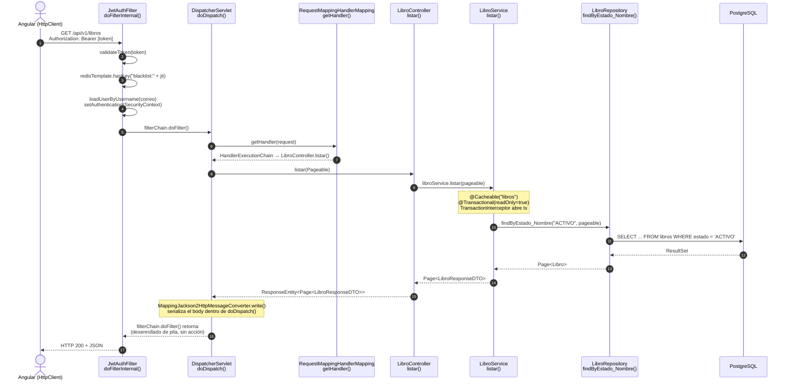

# Trazado del flujo MVC — SGB SaaS

**Endpoint trazado:** `GET /api/v1/libros`  
**Proyecto:** Sistema de Gestión Bibliotecaria (SGB SaaS) — UTEQ  
**Práctica:** Flujo completo de una petición HTTP en Spring Boot 3

---

## Tabla de trazado

| # | Componente | Clase Java | Método | Paquete |
|---|---|---|---|---|
| 1 | Cliente Angular | (no es Java) | `LibroService.getLibros()` | `frontend/src` |
| 2 | Tomcat embebido | (automático) | Gestionado por Spring Boot | Spring interno |
| 3 | DispatcherServlet | `DispatcherServlet` | `doDispatch()` | Spring interno |
| 4 | Filtro JWT | `JwtAuthFilter` | `doFilterInternal()` | `com.uteq.backend.security` |
| 5 | HandlerMapping | `RequestMappingHandlerMapping` | `getHandler()` | Spring interno |
| 6 | Controlador | `LibroController` | `listar()` | `com.uteq.backend.controller` |
| 7 | Servicio | `LibroService` | `listar()` | `com.uteq.backend.service` |
| 8 | Repositorio | `LibroRepository` | `findByEstado_Nombre()` | `com.uteq.backend.repository` |
| 9 | Serialización JSON | `MappingJackson2HttpMessageConverter` | `write()` | Spring interno |

---

## Diagrama de secuencia UML

---

## Notas del trazado

- **Paso 4 — JwtAuthFilter:** realiza tres validaciones en secuencia: firma/expiración del token (`jwtService.validateToken()`), blacklist en Redis (`redisTemplate.hasKey("blacklist:" + jti)`), y carga del usuario con establecimiento del `SecurityContext`. Si cualquiera falla, continúa la cadena sin autenticar → Spring Security devuelve 401/403.
- **Paso 7 — LibroService:** anotado con `@Cacheable("libros")` y `@Transactional(readOnly = true)`. Spring AOP intercepta la llamada con `TransactionInterceptor` antes de ejecutar el método.
- **Paso 8 — LibroRepository:** el método real invocado es `findByEstado_Nombre("ACTIVO", pageable)`, no `findAll()`. Hibernate genera un `SELECT` con `JOIN` a la tabla `estados_libro`.
- **Paso 9 — Serialización JSON:** `MappingJackson2HttpMessageConverter.write()` se ejecuta dentro de `DispatcherServlet.doDispatch()`, antes de que ese método retorne — no lo ejecuta `JwtAuthFilter`. El paso de la respuesta por `JwtAuthFilter` en el diagrama representa el desenrollado del stack (`filterChain.doFilter()` retornando), no una acción del filtro sobre la respuesta.
