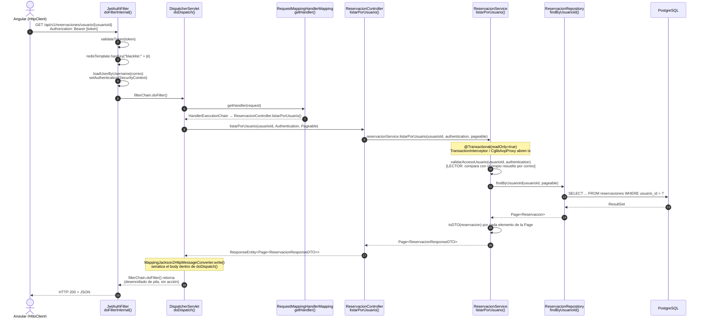

# Trazado del flujo MVC — SGB SaaS

**Endpoint trazado:** `GET /api/v1/reservaciones/usuario/{usuarioId}`
**Proyecto:** Sistema de Gestión Bibliotecaria (SGB SaaS) — UTEQ
**Práctica:** Flujo completo de una petición HTTP en Spring Boot 3

---

## Tabla de trazado

| # | Componente | Clase Java | Método | Paquete |
|---|---|---|---|---|
| 1 | Cliente Angular | (no es Java) | `ReservacionesComponent.cargarPagina()` | `frontend-angular/src/app/reservaciones` |
| 2 | Tomcat embebido | (automático) | Gestionado por Spring Boot | Spring interno |
| 3 | DispatcherServlet | `DispatcherServlet` | `doDispatch()` | Spring interno |
| 4 | Filtro JWT | `JwtAuthFilter` | `doFilterInternal()` | `com.uteq.backend.security` |
| 5 | HandlerMapping | `RequestMappingHandlerMapping` | `getHandler()` | Spring interno |
| 6 | Controlador | `ReservacionController` | `listarPorUsuario()` | `com.uteq.backend.controller` |
| 7 | Servicio | `ReservacionService` | `listarPorUsuario()` | `com.uteq.backend.service` |
| 8 | Repositorio | `ReservacionRepository` | `findByUsuarioId()` | `com.uteq.backend.repository` |
| 9 | Serialización JSON | `MappingJackson2HttpMessageConverter` | `write()` | Spring interno |

---

## Diagrama de secuencia UML

---

## Notas del trazado

- **Paso 4 — JwtAuthFilter:** realiza tres validaciones en secuencia: firma/expiración del token (`jwtService.validateToken()`), blacklist en Redis (`redisTemplate.hasKey("blacklist:" + jti)`), y carga del usuario con establecimiento del `SecurityContext`. Si falta el token o es inválido, el filtro deja pasar la solicitud sin autenticar (no corta la cadena él mismo); es la regla `anyRequest().authenticated()` de `SecurityConfig` la que responde **401** más adelante.
- **Paso 7 — ReservacionService:** anotado con `@Transactional(readOnly = true)`. Spring AOP intercepta la llamada con un proxy CGLIB (`CglibAopProxy`) y `TransactionInterceptor` antes de ejecutar el método real. Además, a diferencia de un listado simple, primero ejecuta `validarAccesoUsuario()`: si el usuario autenticado tiene rol `LECTOR`, solo puede consultar sus propias reservaciones (compara `usuarioId` de la URL contra el id resuelto por su propio correo); si es `BIBLIOTECARIO` o `GERENTE`, la restricción no aplica. Si un `LECTOR` intenta ver reservaciones ajenas, se lanza `AuthorizationDeniedException` → **403 Forbidden**, antes de tocar el repositorio.
- **Paso 8 — ReservacionRepository:** el método real invocado es `findByUsuarioId(usuarioId, pageable)`, generado por Spring Data JPA sobre `SimpleJpaRepository` a partir del nombre del método (Query Derivation) — no existe una implementación escrita a mano. Devuelve entidades `Reservacion` completas, no el DTO directamente; el mapeo a `ReservacionResponseDTO` ocurre después, en el servicio.
- **Paso 9 — Serialización JSON:** `MappingJackson2HttpMessageConverter.write()` se ejecuta dentro de `DispatcherServlet.doDispatch()`, antes de que ese método retorne — no lo ejecuta `JwtAuthFilter`. El paso de la respuesta por `JwtAuthFilter` en el diagrama representa el desenrollado del stack (`filterChain.doFilter()` retornando), no una acción del filtro sobre la respuesta.